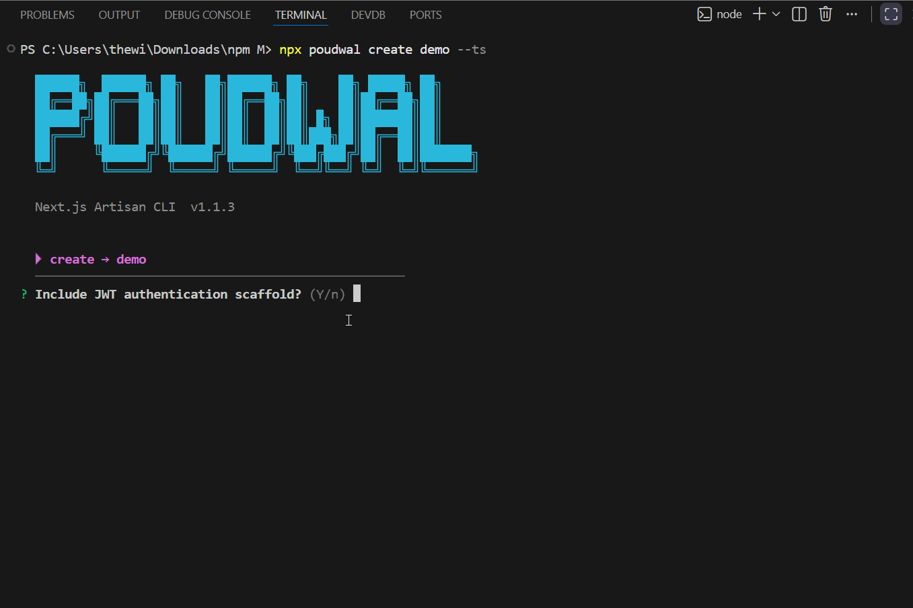

## 🎬 Demo



# 🧰 poudwal

🚀 **Artisan for Next.js** — A powerful CLI inspired by Laravel Artisan for
**Next.js 14 App Router** with built-in **MongoDB + JWT Authentication**

---

## ✨ Overview

**poudwal** is a developer productivity CLI that removes repetitive backend setup in Next.js projects.

It helps you quickly scaffold and scale full-stack applications by generating:

* Models (Mongoose)
* API routes (App Router)
* Full CRUD systems
* JWT Authentication (login/register)
* Middleware & utilities

👉 Designed for developers who want **Laravel-like development speed in Next.js**

---

## 🔥 Key Features

* ⚡ One-command project scaffolding
* 🔐 JWT Authentication setup (login/register)
* 🧱 Clean and scalable folder structure
* 📦 MongoDB integration with Mongoose
* 🔄 Full CRUD API generation
* 🧩 Modular template system
* 🟦 TypeScript support
* 🎯 Zero configuration required

---

## 🚀 Quick Start

```bash
npx poudwal create my-app --ts
cd my-app
npm install
npm run dev
```

---

## 🧑‍💻 Real World Example

```bash
npx poudwal create ecommerce-app --ts

cd ecommerce-app

# Create APIs
npx poudwal make:crud product
npx poudwal make:crud order

# Add authentication
npx poudwal install:auth
```

🎉 You now have:

* Product & Order APIs
* JWT authentication
* MongoDB setup
* Ready-to-use backend

---

## 📦 Installation

### 🔹 Using npx (Recommended)

```bash
npx poudwal <command>
```

### 🔹 Local Development

```bash
git clone <your-repo>
cd poudwal
npm install
npm link
```

---

## ⚙️ CLI Commands

---

### 🏗 `poudwal create <app-name>`

Scaffold a complete Next.js project with MongoDB + optional JWT auth.

```bash
poudwal create my-app
poudwal create my-app --ts
```

#### 📁 Generated Structure

```
my-app/
├── app/
│   ├── layout.(jsx|tsx)
│   ├── page.(jsx|tsx)
│   ├── globals.css
│   └── api/
│       └── auth/
│           ├── register/route.(js|ts)
│           └── login/route.(js|ts)
├── lib/
│   ├── mongo.(js|ts)
│   └── jwt.(js|ts)
├── models/
│   └── User.(js|ts)
├── middlewares/
├── middleware.(js|ts)
├── .env.local
├── .gitignore
├── next.config.(js|ts)
├── tsconfig.json      (TS only)
└── package.json
```

---

### 🧩 `poudwal make:model <Name>`

Generate a Mongoose model.

```bash
poudwal make:model User
poudwal make:model BlogPost --ts
```

**Generates:**
`models/User.js` or `models/BlogPost.ts`

---

### 🌐 `poudwal make:api <name>`

Generate a Next.js App Router API route (GET list + POST create).

```bash
poudwal make:api product
poudwal make:api blog-post --ts
```

**Generates:**
`app/api/product/route.js`

---

### 🔥 `poudwal make:crud <name>`

Generate a model + full CRUD API.

```bash
poudwal make:crud Product
poudwal make:crud BlogPost --ts
```

#### 📁 Output

```
models/Product.js
app/api/product/route.js
app/api/product/[id]/route.js
```

#### 🌍 Endpoints

| Method | Path                | Action   |
| ------ | ------------------- | -------- |
| GET    | `/api/product`      | List all |
| POST   | `/api/product`      | Create   |
| GET    | `/api/product/[id]` | Get one  |
| PUT    | `/api/product/[id]` | Update   |
| DELETE | `/api/product/[id]` | Delete   |

---

### 🛡 `poudwal install:auth`

Scaffold JWT authentication into an **existing Next.js project**.

```bash
poudwal install:auth
poudwal install:auth --ts
```

#### 📁 Generates

* `lib/mongo.(js|ts)` – MongoDB connection with cache
* `lib/jwt.(js|ts)` – JWT sign, verify, extract token
* `models/User.(js|ts)` – User model with bcrypt
* `app/api/auth/register/route.(js|ts)`
* `app/api/auth/login/route.(js|ts)`
* `middleware.(js|ts)` – JWT guard for `/api/*` routes

---

### ⚙️ Other Commands

#### `make:middleware`

```bash
poudwal make:middleware auth
poudwal make:middleware rate-limit --ts
```

#### `make:lib`

```bash
poudwal make:lib mongo
poudwal make:lib redis --ts
```

---

## 🔐 Authentication Flow

1. User registers → password hashed using bcrypt
2. User logs in → JWT token generated
3. Middleware verifies token for protected routes (`/api/*`)

---

## 🌱 Environment Variables

Create `.env.local` in your Next.js project:

```env
MONGODB_URI=mongodb://localhost:27017/myapp
JWT_SECRET=your_super_secret_key
JWT_EXPIRES=7d
NEXT_PUBLIC_APP_URL=http://localhost:3000
```

---

## 📦 Dependencies (Install in your project)

```bash
npm install mongoose bcryptjs jsonwebtoken
```

### TypeScript Support

```bash
npm install -D @types/bcryptjs @types/jsonwebtoken
```

---

## 🧠 Template System

Templates use dynamic placeholders:

| Placeholder     | Example |
| --------------- | ------- |
| `{{name}}`      | Product |
| `{{modelName}}` | Product |
| `{{routeName}}` | product |
| `{{appName}}`   | my-app  |

---

## 🛠 Adding Custom Templates

1. Create `.tpl` file inside `templates/`
2. Use `{{placeholder}}` syntax
3. Render using:

```js
renderTemplate(tplPath, { key: value })
```

---

## 📁 Internal Structure

```
poudwal/
├── bin/
│   └── poudwal.js
├── commands/
├── templates/
├── utils/
└── package.json
```

---

## 🆚 Why not just Next.js?

| Feature    | Next.js  | poudwal          |
| ---------- | -------- | ---------------- |
| API setup  | Manual   | ⚡ Auto-generated |
| Auth setup | Manual   | 🔐 One command   |
| CRUD setup | Manual   | 🚀 Instant       |
| Structure  | Flexible | 🧱 Scalable      |

---

## 🚀 Roadmap

* Prisma support
* Zod validation
* Role-based authentication
* Swagger API docs
* Admin dashboard starter

---

## 🤝 Contributing

Contributions are welcome!
Feel free to open issues or submit pull requests.

---

## 📄 License

MIT
